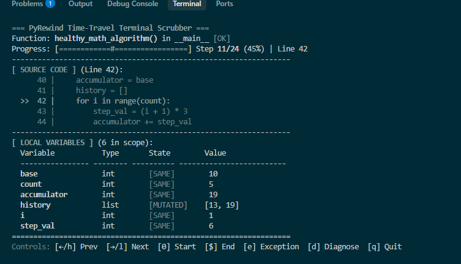
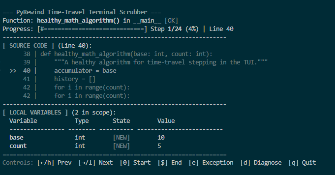

# pyrewind: Python Execution Forensics, Time-Travel Debugging & Automated Diagnostics

<p align="left">
  <a href="https://pypi.org/project/pyrewind-dev/"></a>
  <a href="LICENSE"></a>
  <a href="https://www.python.org/downloads/"></a>
  
  
</p>

`pyrewind` is a zero-dependency Python execution forensics, time-travel debugging, and automated diagnostic library. It records the step-by-step lifecycle of Python functions, freezes local variable mutations across execution steps, provides an interactive terminal time-travel scrubber, and automatically identifies root causes and anomalies when functions crash or produce invalid states.

---

## Key Capabilities

1. **Interactive Terminal TUI Scrubber (`pyrewind tui`)**:
   - Step forward and backward through execution history using standard keyboard navigation.
   - Dual-pane layout: source code highlighting on the left, local variable mutation table on the right.
   - Jump directly to exceptions, checkpoints, and performance bottlenecks.
2. **Automated Root-Cause Diagnostic & Anomaly Engine (`pyrewind diagnose` / `pyrewind.diagnostics`)**:
   - **`RootCauseExplainer`**: Backward data-flow dependency analysis from exceptions or return values to pinpoint the originating line and mutated variable.
   - **`AnomalyDetector`**: Identifies unexpected `None` transitions, `NaN`/`Inf` arithmetic bugs, runaway collection growth inside loops, and timing execution spikes.
3. **Assisted Replay & Parameter Overrides (`replay`)**:
   - Fluent replay builder for rerunning functions with modified arguments or step overrides.
4. **Trace Analysis & Comparison (`TraceInspector` & `TraceComparison`)**:
   - Performance hotspot identification, execution diffing between multiple runs, and variable lifecycle inspection.
5. **Zero External Runtime Dependencies**:
   - Implemented entirely with the Python Standard Library.

---

## Interactive Terminal TUI Showcase

The interactive terminal scrubber enables developers to inspect execution states without external GUI or web dependencies:

### 1. Loop Iteration & Variable Mutation Tracking
Live execution view showing active source code line highlight alongside the mutated local variables table:



### 2. Initial Step Allocation & Scope Inspection
Initial execution step displaying captured function arguments and variable initialization states:



---

## Installation

```bash
# Install from PyPI
pip install pyrewind

# Or install from source in editable mode
git clone https://github.com/adityarajIITj/PYREWIND.git
cd PYREWIND
pip install -e .
```

---

## Quickstart Guide

### 1. Tracing Function Execution
```python
from pyrewind import rewindable

@rewindable
def calculate_tax(gross_income, deduction_rate):
    deductions = gross_income * deduction_rate
    taxable_amount = gross_income - deductions
    tax = taxable_amount * 0.20
    return tax

# Run with trace recording
tax, trace = calculate_tax.run(100_000, 0.15)
print(f"Tax: ${tax}")
print(f"Recorded Steps: {len(trace.steps)}")

# Inspect step 0 locals
print(trace.at(0).locals())
```

---

### 2. Interactive Terminal Time-Travel Scrubber (`TUI`)

Scrub through any recorded trace interactively in your terminal:

```python
from pyrewind import rewindable, launch_tui

@rewindable
def complex_algorithm():
    data = []
    for i in range(5):
        data.append(i * 10)
    return sum(data)

complex_algorithm.run()
launch_tui(complex_algorithm.last_trace)
```

**Or from the CLI**:
```bash
pyrewind tui trace.json
```

**Keybindings**:
- `[<- / h]`: Step Backward
- `[-> / l]`: Step Forward
- `[0 / Home]`: Jump to First Step
- `[$ / End]`: Jump to Last Step
- `[e]`: Jump directly to Exception
- `[d]`: View Full Diagnostic Report
- `[q]`: Quit Scrubber

---

### 3. Automated Root-Cause Diagnostics & Anomaly Detection

```python
from pyrewind import rewindable, diagnose_trace

@rewindable
def process_pipeline(val, rate):
    offset = rate - 0.05
    divisor = offset + 1.0  # Divisor becomes 0 if rate == -0.95
    return (val * 1.5) / divisor

try:
    process_pipeline.run(1000, -0.95)
except ZeroDivisionError:
    pass

# Generate automated root cause report
report = diagnose_trace(process_pipeline.last_trace)
print(report)
```

**Sample Diagnostic Output**:
```
=== PyRewind Automated Diagnostic Report ===
Function: process_pipeline (__main__)
Total Steps: 5 | Trace ID: 2a7804a2
------------------------------------------------------------

[!] ROOT CAUSE DIAGNOSIS: ZeroDivisionError
    Message: division by zero
    Failure Point: Step #4 (line 7)
    Root Cause Point: Step #3 (line 6)

    Explanation: ZeroDivisionError occurred at line 7 because variable 'divisor' was evaluated as 0. Variable 'divisor' was assigned 0 at Step #3 (line 6).
    Remediation: Add a defensive check: 'if divisor == 0: ...' or check the assignment logic at line 6.

    Tainted Variables:
      - divisor: introduced at Step #3 (line 6) -> Assigned 0/0.0 at Step #3 (line 6), subsequently used as divisor.

[*] DETECTED ANOMALIES (0 found):
    No data-flow or arithmetic anomalies detected.
============================================================
```

---

## CLI Command Reference

| Command | Usage | Description |
| :--- | :--- | :--- |
| **`tui`** | `pyrewind tui <trace.json>` | Launch interactive Terminal Time-Travel Scrubber. |
| **`diagnose`** | `pyrewind diagnose <trace.json> [--var <name>]` | Run automated root-cause & anomaly diagnostics. |
| **`inspect`** | `pyrewind inspect <trace.json> [-v]` | Print statistical timing and variable summaries. |
| **`diff`** | `pyrewind diff <trace1.json> <trace2.json>` | Compare two execution traces and identify divergences. |
| **`export`** | `pyrewind export <trace.json> -o out.html -f html` | Export trace to HTML, CSV, or JSON. |

---

## Automated Test Suite

```bash
pytest tests -v
```
All **59 unit tests** pass in under 0.5s.

---

## License

Distributed under the MIT License. See [LICENSE](LICENSE) for details.

---

## Author

**Aditya Raj and Divyansh Sharma**  
Indian Institute of Technology Jodhpur (IIT Jodhpur)  
Email: [b25bs1020@iitj.ac.in](mailto:b25bs1020@iitj.ac.in)  [b25bs1093@iitj.ac.in](mailto:b25bs1093@iitj.ac.in) 
